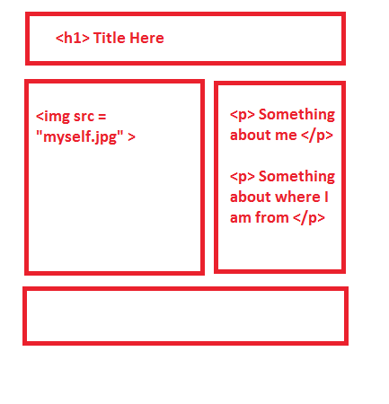

## Your personal website

- Now that you've gotten a taste on simple html / css, we're going to learn to build
a proper personal website.

  

- The website will have 4 sections:
  - A header where you can put your name.
  - A short list to the right with your details, for example:
    - Your age, your education, your favourite things, and hobbies
  - An image of yourself to the left.
  - A colored footer to close off your webpage.

## Setting up the layout.

- Let's start by setting up the layout:
  ```
  <html>
    <head>
      <title>My website</title>
      <meta name="viewport" content="width=device-width, initial-scale=1.0">
    </head>
    <body>
    </body>
  </html>
  ```

- Next, we're going to build the header first to put your name. For this lesson, we're going
to use flexboxes. Flexboxes are a set of `CSS` instructions that help you craft how and where you would want to put things in your webpage.

- We're going to `ADD` some `CSS` now:

  ```
  .container {
    max-width: 1200px;
    margin: 10px auto;
  }

  .header {
    margin: 5px;
    border: 1px solid black;
  }

  .text-center {
    text-align: center;
  }
  ```

- We're setting up a `container` to scope the size of our webpage to just 1200px.

- `max-width` sets the maximum width this element will stretch, which is in this case 1200px.

- `margin` is to set some space between the element and it's outer environment, the first value of `10px` sets the top and lower part of the element while `auto` balances the left and right evenly to get a `center` effect.

- `text-align` set the alignment of text to the center.

- Finally, inside your `<body></body>`, `ADD` the following:

```
<div class="container">
  <div class="header">
    <h1 class="text-center">
      <** ADD YOUR NAME HERE **>
    </h1>
  </div>
</div>
```

- What we've done is that we've set up a header section with your name inside it.

## Checkpoint

- Your code should look like this now:

  ```
  <html>
    <head>
      <title>My website</title>
      <meta name="viewport" content="width=device-width, initial-scale=1.0">
    </head>
    <body>
      <div class="container">
        <div class="header">
          <h1 class="text-center">
            <** ADD YOUR NAME HERE **>
          </h1>
        </div>
      </div>
    </body>
  </html>
  ```

## The main parts - the image and information of you

- We'll now create the main section of your web page.

- In your `CSS` file, add the following styling:

```
.about-me {
  width: 100%;
  display: flex;
  justify-content: space-between;
  flex-wrap: wrap;
}

.my-picture, .my-info {
  flex: 1 0;
  min-width: 360px;
  margin: 10px 5px;
  border: 1px solid black;
  text-align: center;
}
```

- These are the functions for creating a flex layout, it's alright if you don't really understand them for now, we'll (the mentors) run through the code with you. The gist of it is that:
  - All flex children requires a flex parent.
  - A flex parent is initialized with `display: flex`.
  - Any element inside a flex-parent is immediately a flex-child, but you can also use the
  css function `flex` to help you lay out your elements better.
  - `flex` accepts 3 parameters - `flex-grow`, `flex-shrink`, and `flex-basis`.
  - For this lesson, we'll just learn to use `flex-grow`. Setting `flex-grow` to 1 as seen here: `flex: 1 0` makes sure than any and all children have the same measurements as each other within the same parent.
  - In this case, we're using 2 `children`, one for your image and the other for your information.
  - `justify-content` is how we want to arrange our flex children, in this case - `space-between` sets a space between each flex children from each other.

- Proceeding to your `HTML`, below your `header` within your `container`, add the following:

  ```
  <div class="about-me">
    <div class="my-picture">
      
    </div>
    <div class="my-info">
        <h1> <-- add-some-information-about-yourself --></h1>
    </div>
  </div>
  ```

- If you want to upload an image of yourself, you can use [imgur](http://imgur.com/) and upload a private photo of yourself.

## Checkpoint

- Your code should look like this now:

  ```
  <html>
    <head>
      <title>My website</title>
      <meta name="viewport" content="width=device-width, initial-scale=1.0">
    </head>
    <body>
      <div class="container">
        <div class="header">
          <h1 class="text-center">
            <-- your-name-here -->
          </h1>
        </div>
        <div class="about-me">
          <div class="my-picture">
            " />
          </div>
          <div class="my-info">
              <h1><-- information-about-you-here --></h1>
          </div>
        </div>
      </div>
    </body>
  </html>
  ```

## The Footer

- Let's finish up by adding a new footer at the bottom:

- We'll start by add some css for the footer:

```
.footer {
  background-color: <pick-your-favourite-color>;
  justify-content: center;
  height: 50px;
  border-color: 1px solid black;
  display: flex;
  align-items: center;
}
```

- Now for some html

```
<div class="footer">
  <p> Made with love in 2016 </p>
</div>
```

## Final Checkpoint

```
<html>
  <head>
    <title>My website</title>
    <meta name="viewport" content="width=device-width, initial-scale=1.0">
  </head>
  <body>
    <div class="container">
      <div class="header">
        <h1 class="text-center">
          <-- your-name-here -->
        </h1>
      </div>
      <div class="about-me">
        <div class="my-picture">
          " />
        </div>
        <div class="my-info">
            <h1><-- information-about-you-here --></h1>
        </div>
      </div>
      <div class="footer">
        <p> Made with love in 2016 </p>
      </div>
    </div>
  </body>
</html>
```

## THE END
